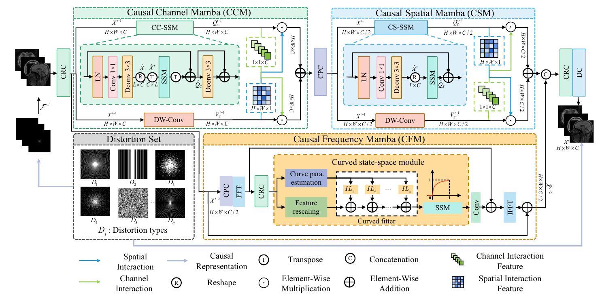
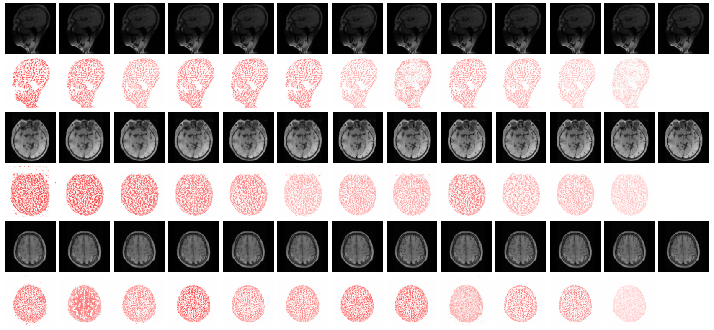
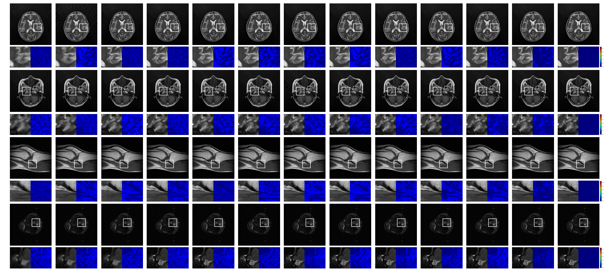

## CIPM-Net

## Causal inertia proximal Mamba network for magnetic resonance image reconstruction


> **Abstract:**  Accurate and rapid Magnetic Resonance Imaging (MRI) is critical for clinical diagnosis. However, different sampling strategies and datasets act as confounding factors, significantly impacting the quality of image reconstruction. While existing methods can capture correlations between data during the imaging process, they overlook the deeper associations rooted in causal relationships. To address this issue, this paper proposes a Causal Inertial Proximal Mamba Network (CIPM-Net) to achieve robust and efficient MRI reconstruction. Specifically, we present a causal inertial proximal iterative algorithm that eliminates biases caused by confounding factors using a causal model, improving the ability of the algorithm to identify spurious correlations. Furthermore, to achieve an effective balance between global perception and computational efficiency during the reconstruction process, the proposed algorithm is extended into a Mamba-based network. At the channel level, a Causal Channel Mamba (CCM) module is introduced to suppress irrelevant channel features, thereby enhancing the quality of the reconstructed images. For spatial features, a novel Causal Spatial Mamba (CSM) module is designed to adaptively assign varying weights to pixel points, optimizing the extraction of spatial information and improving overall reconstruction performance. Additionally, to account for causal relationships in the frequency domain, a Causal Frequency Mamba (CFM) module is introduced to effectively capture complex and elongated pathological features. Extensive experiments across varying acceleration factors demonstrate the superiority of the proposed approach, with results on the IXI and in-house clinical datasets.

⭐If this work is helpful for you, please help star this repo. Thanks!🤗


## 📑 Contents

- [Visual Results](#visual_results)
- [News](#news)
- [Results](#results)
- [Installation](#installation)
- [Datasets](#Datasets)
- [Citation](#cite)


## <a name="Real-SR"></a> 🥇 The proposed CIPM-Net architecture


<p align="center">
    
</p>


## <a name="news"></a> 🆕 News

- **2025-4-03:** The code is being uploaded. 😄


## <a name="results"></a>🔍 Results

We achieve state-of-the-art performance on various dataset. Detailed results can be found in the paper.

<details>
<summary>Evaluation on IXI dataset (click to expand)</summary>
<p align="center">
    
</p>
</details>

<details>
<summary>Evaluation on in-house dataset (click to expand)</summary>
<p align="center">
    
</p>
</details>


## <a name="installation"></a> Installation

This codebase was tested with the following environment configurations. It may work with other versions.

- CUDA 11.7
- Python 3.9
- PyTorch 1.13.1 + cu117
- NVIDIA 3090 GPU (24 GB) 

To use the selective scan with efficient hard-ware design, the `mamba_ssm` library is advised to install with the folllowing command.

```
pip install causal_conv1d==1.0.0
pip install mamba_ssm==1.0.1
```

One can also create a new anaconda environment, and then install necessary python libraries with this [requirement.txt](https://drive.google.com/file/) and the following command: 
```
conda install requirements.txt
```


## Datasets

The datasets used in our training and testing are orgnized as follows:

[IXI](http://brain-development.org/ixi-dataset/) dataset consists of nearly 600 MRIs from healthy subjects. The image acquisition protocol for each subject includes T1-weighted, T2-weighted, proton density (PD)-weighted images, as well as MRI and diffusion-weighted images. These data were collected across three different hospitals in London.


The in-house clinical data were obtained from Gongli Hospital in the Shanghai Pudong New Area and included two datasets: brain and knee. These datasets were collected using the Vantage Titan 3.0T MRI scanner produced by Canon, Japan. For the brain dataset, data from 234 patients were collected, including PDFS, T1WI, and T2WI modalities, with a slice thickness of 4 mm and an inter-slice gap of 1 mm. For the knee dataset, data from 147 patients were acquired using a specially configured 4-channel phased array coil, including T2WI-FS, T1WI, and T2WI modalities.

## <a name="cite"></a> 🥰 Citation

Please cite us if our work is useful for your research.


## Acknowledgement

This code is based on [BasicSR](https://github.com/XPixelGroup/BasicSR), [CausalSR](https://arxiv.org/html/2501.15852) ,and [VMamba](https://github.com/MzeroMiko/VMamba). Thanks for their awesome work.

## Contact

If you have any questions, feel free to approach me.


